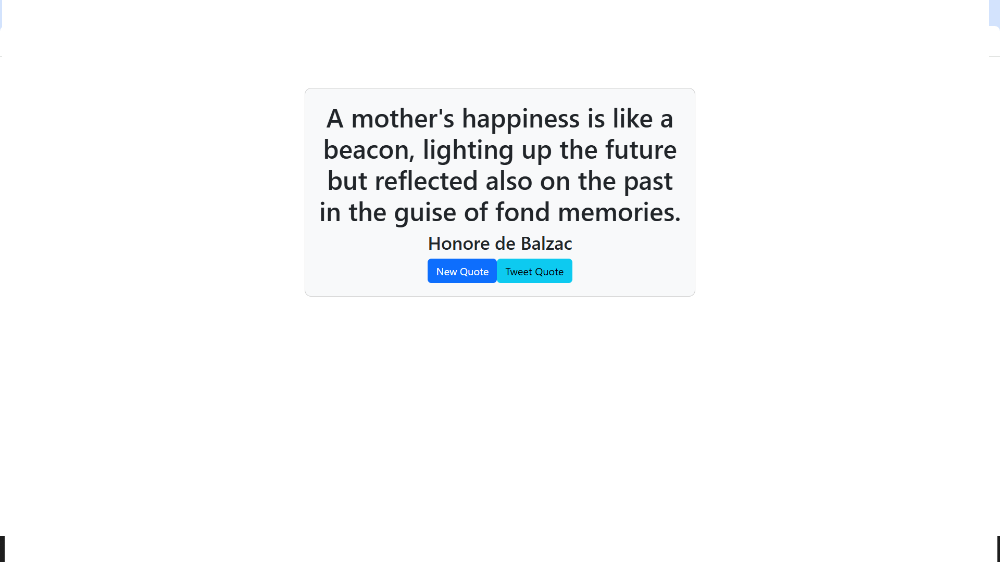

# Random-Quotes



This is a Random Quotes Machine built with React. It fetches quotes from an external API and displays them to the user. Users can also tweet the quotes.

## Features

- Fetches random quotes from an external API
- Displays the quote and author
- Allows users to fetch a new quote
- Allows users to tweet the quote

## Installation

1. Clone the repository:
   ```sh
   git clone https://github.com/AlyAtalla/Random-Quotes.git